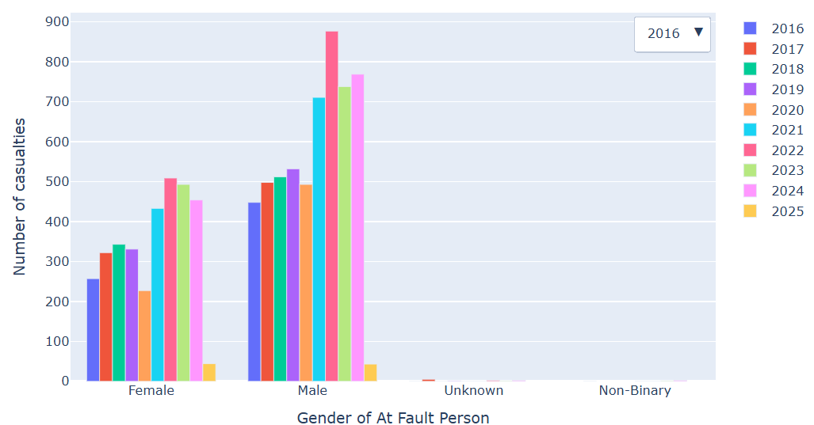

<h1>Exploratory-data-analysis</h1>

In this data analysis project, I aimed to explore and gain insights from crashes in Colorado Springs city dataset. First, I cleaned the data, handeled missing values, removed duplicates, convert data types and checked contradictions in the dataset.
Then, I did exploratory data analaysis, using statistical summaries and visualizations to uncover patterns and trends. In the end, I did advanced analaysis, using multiple variables and advanced graphs. I discovered interesting findings, such as which gender is more involved in accidents, which age group is more involved in severe accidents, and whether the involvement of a pedestrian, motorcycle, or bicycle affects the number of casualties.

The learning on DataCamp helped me a lot in many ways, in the way of thinking, how to extract relevant data, how to clean the data, and also in learning the Pandas library. Also, Datacamp gave me the ability to deal with data on my own.

Link to Kaggle Notebook <href>https://www.kaggle.com/code/oradtelner/exploratory-data-analaysis-crashes-in-colorado</href>

Link to the dataset: <href>https://policedata.coloradosprings.gov/Traffic-Crashes/Crash-Data/bjpt-tkzq/about_data</href>

<b>The most impressive graph:</b>

